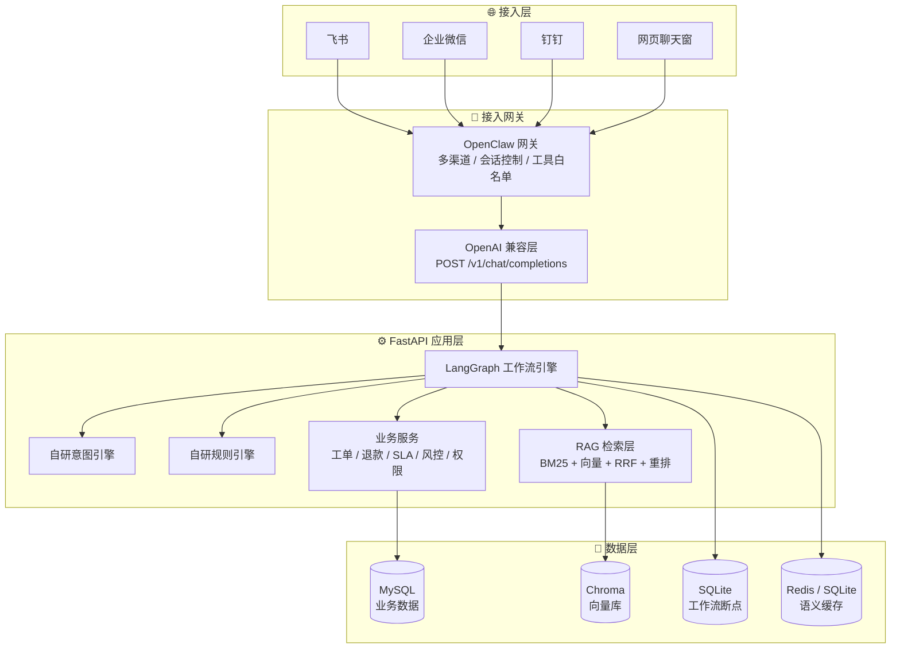
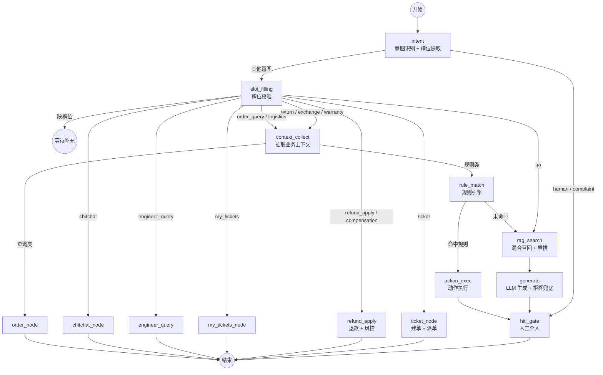

# 企业售后知识库智能问答与工单自动化 Agent 平台

> **Enterprise After-Sales Knowledge Base Agent Platform**
> 基于 **LangGraph + RAG 混合召回 + 自研规则引擎** 的企业级售后 Agent：智能问答、自动建单派单、退款风控、HITL 人工审批与多渠道接入。


**English** · An enterprise after-sales agent platform combining a LangGraph state machine, hybrid RAG retrieval (BM25 + vector + RRF + rerank), a self-built rule engine, ticket workflow automation, refund risk control and human-in-the-loop approval — with a FastAPI backend and a Vue 3 admin console.

---

## 📖 目录

- [业务背景](#-业务背景)
- [核心特性](#-核心特性)
- [系统架构](#-系统架构)
- [Agent 工作流](#-agent-工作流)
- [技术栈](#-技术栈)
- [快速开始](#-快速开始)
- [配置说明](#-配置说明)
- [项目结构](#-项目结构)
- [主要 API](#-主要-api)
- [RAG 评估](#-rag-评估)
- [测试](#-测试)
- [Docker 部署](#-docker-部署)
- [路线图与已知限制](#-路线图与已知限制)
- [安全提示](#-安全提示)

---

## 🎯 业务背景

中小企业售后场景中，产品手册、FAQ、历史工单、订单数据分散在 PDF、Word、Excel、聊天记录与多个业务系统里，导致：

- 客服重复回答同一类问题，效率低
- 工单分派靠人工，错派、重派时有发生
- 知识更新慢，新人上手周期长
- 敏感数据不便直接调用公有云大模型

本平台把 **RAG 智能问答 + 意图识别 + 规则引擎 + 工单状态机 + 人工兜底** 串成一条闭环，并提供一套管理后台。

---

## ✨ 核心特性

### 🤖 智能问答（RAG）
- **父子块切片**：子块用于检索，父块用于生成，避免上下文被切碎
- **混合召回**：`jieba + BM25` 关键词召回 ∥ 向量召回，经 **RRF** 融合
- **余弦重排**：对融合结果做 embedding 重排取 Top-K
- **双重过滤防幻觉**：相关性阈值 **或** 实体词（型号/故障码）覆盖才放行，否则**明确拒答**而非编造
- **问题类型路由**：按「原因 / 现象 / 步骤 / 范围 / 注意事项 / 边界」分别用不同 Prompt，并对章节标题做过滤

### 🧠 Agent 编排（LangGraph）
- **16 类意图识别**（自研引擎：关键词 + 正则 + 优先级，YAML 可热加载）
- **多轮槽位填充**：缺关键字段主动追问，追问上下文可跨轮继承
- **业务上下文收集**：订单 / 物流 / 商品 / 客户资产聚合
- **HITL 人工审批**：`interrupt()` 暂停 → 对话内「同意/拒绝」→ 断点恢复，含超时自动取消
- **SQLite Checkpointer**：中断状态跨进程、跨重启保留

### 🎫 工单与售后
- **工单状态机**：`pending → assigned → accepted → in_progress → resolved → closed`
- **自动派单**：按 `技能匹配 → 在线状态 → 负载升序` 选人；**拒单自动重派**（排除原工程师）
- **字段完整度**：允许「待补充」建单，并拦截不完整工单进入处理
- **SLA 时效**：YAML 规则 + 后台每 5 分钟扫描，预警/超时分级通知
- **退款/赔付**：AI 初审（金额 + 客户信用）+ 风控评分（高频退款/退款率/投诉数/短期集中）→ 自动通过或转人工审批 → 执行打款

### 🔌 接入与运维
- **OpenAI 兼容层**：把 LangGraph 伪装成一个 LLM Provider，外部网关零改动接入
- **飞书集成**：出站私聊 / 群 webhook / 事件路由；**飞书身份绑定**（`open_id` + `chat_id` 录入、待绑定列表一键绑定）
- **权限体系**：角色默认权限 + 个人 allow/deny 覆盖
- **审计与通知**：全量操作审计 + 通知投递记录
- **管理后台**：14 个页面（对话测试 / 知识库 / 工单 / 客户 / 退款 / SLA / 工程师 / 人员 / 审批台 / 飞书配置 / 审计 / 通知 / 系统配置 / 监控看板）

---

## 🏗️ 系统架构



**核心设计原则：LangGraph 管内，网关管外。**

- **网关管外**：多渠道接入、会话控制、工具白名单、权限收敛
- **LangGraph 管内**：复杂业务状态机、多轮对话、HITL、子图编排
- 两者通过 **OpenAI 兼容协议**对接，后端只需暴露 `/v1/chat/completions`

---

## 🧠 Agent 工作流



**工作流能力**：状态机持久化（SQLite Checkpointer）、条件路由、`interrupt/resume` 断点恢复、超时自动取消、消息历史按条数截断防膨胀。

---

## 🧰 技术栈

| 层级 | 技术 | 在本项目中的职责 |
|---|---|---|
| **接入网关** | OpenClaw（外部网关） | 多渠道接入、会话控制、工具白名单；后端以 OpenAI 协议对接 |
| | frp | 内网穿透，供外部网关回调本地服务 |
| | 自研 OpenAI 兼容层 | 协议适配、元数据剥离、飞书身份提取、快捷命令短路 |
| **Agent 编排** | LangGraph 1.2 + `langgraph-checkpoint-sqlite` | 主状态机、条件路由、断点持久化与恢复 |
| | 自研意图引擎 | YAML 驱动（关键词 + 正则 + 优先级），16 类意图，支持热加载 |
| | 自研规则引擎 | YAML 规则 + 19 个操作符 + 点号路径取值，支持热加载 |
| **RAG** | Chroma 1.5 | 向量库（embedded 本地持久化 / HTTP 两种模式） |
| | jieba + rank-bm25 | 中文分词与关键词召回 |
| | RRF + 余弦重排 | 多路召回融合与精排 |
| | 自研父子块切片 | 递归分隔符 + 标题路径 + 子块上下文前置 |
| | pypdf / python-docx / openpyxl | 知识库 PDF / Word / Excel 解析入库 |
| **模型** | Ollama（本地）∥ OpenAI 兼容云端 | LLM 与 Embedding，按 `base_url` 自动切换；支持云端异常降级 |
| **后端** | FastAPI + Uvicorn | 15 个路由模块，OpenAPI 文档 |
| | Pydantic v2 + pydantic-settings | 请求/响应模型与 `.env` 配置 |
| **数据** | MySQL 8 + SQLAlchemy 2.0 + PyMySQL | 业务数据（可切 SQLite） |
| | Redis ∥ SQLite | 语义缓存（Redis 不可用自动降级） |
| | SQLite | 工作流断点存储 |
| **认证** | PyJWT + 加盐 SHA-256 | JWT 登录、角色与权限点校验 |
| **前端** | Vue 3 + Vite 5 | 管理后台 SPA |
| | Element Plus + ECharts | UI 组件与可视化 |
| | Axios + Vue Router | HTTP 封装（含 401 拦截）与 history 路由 |
| **评估** | 自研评估器（LLM-as-judge） | 4 项 RAG 指标；另提供 RAGAS 脚本 |
| **测试** | pytest + pytest-asyncio | 43 个用例 |
| **部署** | Docker Compose | MySQL + Redis + Chroma + App 四容器编排 |

> **架构特点**：意图引擎与规则引擎均为 **与业务解耦的自研框架**（`core / loaders / data` 三层分离），可通过 YAML 热加载扩展，不依赖 LangChain 的 agent 抽象。

---

## 🚀 快速开始

### 环境要求

| 组件 | 版本 | 是否必需 |
|---|---|---|
| Python | 3.12+ | ✅ |
| Node.js | 20+ | ✅ |
| MySQL | 8.0 | ✅（默认；也可切 SQLite） |
| LLM / Embedding | Ollama **或** 任意 OpenAI 兼容云端 API | ✅（二选一） |
| Redis | 7+ | ⭕ 可选（未启用时自动降级 SQLite 缓存） |
| Chroma 服务 | 1.5+ | ⭕ 可选（默认 embedded，无需单独部署） |

### 1. 后端

```bash
# 创建虚拟环境
python -m venv venv
venv\Scripts\activate          # Windows
# source venv/bin/activate     # macOS / Linux

# 安装依赖
pip install -r requirements.txt

# 配置环境变量（务必按需修改，不要提交 .env）
copy .env.example .env         # Windows
# cp .env.example .env         # macOS / Linux

# 初始化数据库表 + 灌入初始数据（顺序重要）
python scripts/seed_engineers.py     # 1) 工程师
python scripts/seed_customers.py     # 2) 客户与订单
python scripts/migrate_users.py      # 3) 迁移为统一人员表 + 默认管理员

# 启动
python -m uvicorn app.main:app --host 127.0.0.1 --port 8000 --reload
```

访问 **http://127.0.0.1:8000/docs** 查看 API 文档，**http://127.0.0.1:8000/health** 健康检查。

### 2. 前端

```bash
cd frontend
npm install
npm run dev
```

访问 **http://127.0.0.1:5173**（Vite 已配置 `/api` → `127.0.0.1:8000` 代理）。

### 3. 默认账号

| 账号 | 密码 | 角色 |
|---|---|---|
| `管理员` | `admin123` | admin |

> ⚠️ 默认密码仅供本地演示，**上线前必须修改**（或直接改 `scripts/migrate_users.py` 的 `DEFAULT_ADMIN_PWD`）。

### 4. 灌入知识库

登录后台 → **知识库** → 上传 PDF / Word / Excel / Markdown / txt，系统会自动清洗、父子块切片、向量化入库。
也可通过 `POST /knowledge/ingest` 直接提交纯文本。

---

## ⚙️ 配置说明

所有配置经 `.env` 注入（由 `pydantic-settings` 读取）。常用项：

| 变量 | 说明 | 示例 |
|---|---|---|
| `APP_PORT` | 后端端口 | `8000` |
| `LLM_PROVIDER` | `ollama_native` 或 `openai_compat` | `openai_compat` |
| `LLM_BASE_URL` / `LLM_MODEL` / `LLM_API_KEY` | 云端 LLM 配置（OpenAI 兼容） | `https://api.deepseek.com/v1` / `deepseek-chat` |
| `OLLAMA_BASE_URL` / `OLLAMA_LLM_MODEL` | 本地 LLM 配置 | `http://127.0.0.1:11434` |
| `EMBEDDING_PROVIDER` / `EMBEDDING_MODEL` | 向量模型 | `bge-m3:latest` |
| `CHROMA_MODE` | `embedded`（本地目录）/ `http`（服务） | `embedded` |
| `DB_MODE` | `mysql` / `sqlite` | `mysql` |
| `MYSQL_HOST` / `MYSQL_PORT` / `MYSQL_USER` / `MYSQL_PASSWORD` / `MYSQL_DATABASE` | 业务库连接 | `127.0.0.1` / `3306` |
| `CACHE_BACKEND` | `redis` / `sqlite` | `sqlite` |
| `REDIS_URL` | Redis 连接串 | `redis://127.0.0.1:6379/0` |
| `CHUNK_SIZE` / `CHUNK_OVERLAP` / `TOP_K_RETRIEVE` / `TOP_K_RERANK` | RAG 切片与召回参数 | `512` / `64` / `20` / `5` |
| `MIN_RELEVANCE_SCORE` | 拒答阈值 | `0.55` |
| `JWT_SECRET` / `JWT_EXPIRE_HOURS` | JWT 密钥与有效期 | **必须改** |
| `OPENCLAW_ENABLED` / `OPENCLAW_GATEWAY_URL` | 外部网关开关与地址 | `false` |

> 💡 **免外部依赖的最小配置**：`DB_MODE=sqlite` + `CACHE_BACKEND=sqlite` + `CHROMA_MODE=embedded` + `LLM_PROVIDER=ollama_native`，即可完全离线运行。

---

## 📁 项目结构

```
.
├── app/                        # 后端
│   ├── main.py                 # FastAPI 入口（路由挂载 / 后台任务 / RAG 预热）
│   ├── api/
│   │   ├── routes/             # 15 个路由模块
│   │   └── schemas/            # Pydantic 请求响应模型
│   ├── workflows/              # LangGraph 工作流
│   │   ├── graph.py            # 状态图编排、条件路由、Checkpointer
│   │   ├── state.py            # AgentState 定义
│   │   └── nodes/              # 14 个工作流节点
│   ├── rag/                    # 检索层（切片 / 向量 / 混合召回 / 重排）
│   ├── intent/                 # 自研意图引擎（core / loaders / data）
│   ├── rules/                  # 自研规则引擎（core / loaders / data）
│   ├── services/               # 业务服务（工单/退款/SLA/风控/权限/缓存/飞书路由）
│   ├── db/                     # SQLAlchemy 模型与会话
│   ├── integrations/           # 飞书客户端
│   ├── notify/                 # 通知投递
│   ├── audit/                  # 审计日志
│   ├── gateway/                # 网关 Skill 定义
│   ├── evaluation/             # 自研 RAG 评估
│   └── config/                 # 配置与规则 YAML
├── frontend/                   # Vue 3 管理后台（14 个页面）
│   └── src/{views,api,router,layouts}
├── docs/                       # 需求 / 架构 / 接口 / 数据 / 部署文档
├── scripts/                    # 初始化、种子数据、评估脚本
├── tests/                      # pytest 用例
├── docker-compose.yml          # 全栈编排
├── requirements.txt
└── .env.example                # 配置模板（不含任何密钥）
```

---

## 📡 主要 API

| 分组 | 方法 | 路径 | 说明 |
|---|---|---|---|
| **对话** | POST | `/chat` | 智能问答（含 HITL 决策恢复） |
| | POST | `/v1/chat/completions` | OpenAI 兼容端点（网关接入） |
| | POST | `/threads/{id}/runs/stream` | SSE 事件流 |
| | POST | `/threads/{id}/runs/resume` | HITL 断点恢复 |
| **知识库** | GET / POST / PUT / DELETE | `/knowledge/docs` | 文档列表 / 入库 / 编辑 / 删除 |
| | POST | `/knowledge/ingest-file` | 文件上传入库 |
| **工单** | GET / POST | `/tickets` | 列表 / 建单 |
| | POST | `/tickets/{id}/{accept\|reject\|start\|resolve\|close}` | 状态流转（拒单自动重派） |
| **退款** | GET / POST | `/refunds` | 列表 / 创建（含 AI 初审 + 风控） |
| | POST | `/refunds/{id}/approve` · `/refunds/{id}/execute` | 审批 / 执行 |
| **审批台** | GET | `/approvals/pending` · `/approvals/stats` | 待审批聚合 |
| | POST | `/approvals/refunds/batch` · `/approvals/tickets/{id}/reassign` | 批量审批 / 改派 |
| **人员** | GET / POST / PUT / DELETE | `/users` | 人员 CRUD |
| | GET | `/users/pending-bindings` | 待绑定飞书账号 |
| | POST | `/users/pending-bindings/bind` | 一键绑定 open_id |
| **认证** | POST | `/auth/login` · `/auth/change-password` | 登录 / 改密 |
| **SLA** | GET | `/sla/summary` · `/sla/rules` · `/sla/tickets` | 汇总 / 规则 / 倒计时 |
| **运维** | GET | `/logs/audit` · `/logs/notifications` | 审计与通知 |
| | GET / POST | `/admin/config` · `/admin/reload` · `/admin/dashboard/stats` | 配置热重载 / 看板 |

完整契约见 `/docs`（Swagger UI）与 [`docs/05-api-spec.md`](docs/05-api-spec.md)。

---

## 🔬 RAG 评估

内置两套评估方式：

```bash
# 1) 自研评估器（不依赖 ragas，4 项指标 · LLM-as-judge）
python scripts/run_eval.py

# 2) RAGAS 官方评估（可选，需已安装 ragas / datasets）
python scripts/run_ragas.py
```

| 指标 | 含义 |
|---|---|
| `context_recall` | 检索到的上下文能否覆盖标准答案 |
| `context_precision` | 检索结果中有多少是相关的 |
| `answer_relevancy` | 答案与问题的相关程度 |
| `faithfulness` | 答案是否忠实于给定上下文（反幻觉） |

---

## 🧪 测试

```bash
python -m pytest -q
```

覆盖范围：意图识别与槽位提取、规则引擎与操作符、文档切片、缓存服务、认证与权限、工单与 SLA 接口。

---

## 🐳 Docker 部署

```bash
docker compose build app
docker compose up -d
docker compose ps
```

| 服务 | 端口映射 |
|---|---|
| `app` | `8000:8000` |
| `mysql` | `3307:3306` |
| `redis` | `6379:6379` |
| `chroma` | `8001:8000` |

> 容器内应将 `MYSQL_HOST` 设为 `mysql`、`CHROMA_MODE` 设为 `http`，参见 `.env.production`。

---

## 🗺️ 路线图与已知限制

### ✅ 已实现
RAG 混合召回与拒答 · 16 类意图识别 · 规则引擎 · 工单状态机与自动派单 · SLA 扫描告警 · 退款风控与审批 · HITL 断点恢复 · 人员权限体系 · 知识库管理 · 飞书出站通知与身份绑定 · 14 页管理后台 · 43 个测试用例

### 🚧 规划中 / 待完善

| 方向 | 事项 |
|---|---|
| **飞书入站** | 本地自建事件回调（`challenge` 校验 + 消息解析 + 幂等去重），当前入站依赖外部网关 |
| **可观测** | Prometheus `/metrics`、LangSmith 链路追踪（依赖已声明，尚未接入） |
| **安全** | 业务路由的鉴权覆盖（目前仅审批台强校验）；默认口令强制修改 |
| **异步化** | Celery 异步通知与任务队列（当前为同步调用） |
| **数据库** | Alembic 迁移（当前使用 `create_all`）；生产环境 Checkpointer 迁移至 PostgreSQL |
| **知识库** | 文档版本管理、权限过滤、人工修正答案回流 |
| **部署** | 生产 Docker 全栈验证、Nginx 反代与 HTTPS |

### ⚠️ 已知限制

- 业务库与人员表曾存在双表并存的历史设计，现已统一到 `users` 表
- 部分业务路由尚未接入统一鉴权，仅适合内网/演示环境
- 示例数据为模拟数据（订单/客户/物流）

---

## 🔐 安全提示

- `.env` 已被 `.gitignore` 排除，**请勿提交任何真实密钥**
- 仓库内 `.env.example` 仅含占位符，可作为配置模板
- 上线前务必修改：`JWT_SECRET`、默认管理员密码、MySQL 口令、各平台 API Key
- 建议：密钥交由 Secret Manager 管理；管理后台启用 HTTPS

---

## 📄 License

本项目为**内部项目**（Internal Use Only）。如需开源，请先补充 `LICENSE` 文件并调整 `pyproject.toml` 中的 license 字段。
