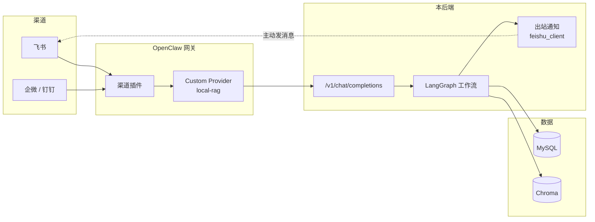

# OpenClaw 接入与部署

> 本文说明 OpenClaw 在本项目中的**实际角色**、后端对外暴露的**对接契约**、
> 网关上需要配置什么，以及**本地调试 → 上传服务器**的完整路径与排错手册。

---

## 1. 为什么要有 OpenClaw

本项目的设计原则是 **「LangGraph 管内，OpenClaw 管外」**：

| | 负责 |
|---|---|
| **OpenClaw（网关，管外）** | 多渠道接入（飞书 / 企微 / 钉钉 / 网页）、会话隔离、消息去重、工具白名单、渠道凭据管理 |
| **LangGraph（后端，管内）** | 业务状态机、多轮对话、RAG 检索、规则引擎、工单/退款、HITL 人工审批 |

这样后端**不需要实现**各渠道的事件回调、签名校验、消息去重与多租户会话——它只要把
自己**伪装成一个 OpenAI 兼容的大模型**，网关就会像调用 LLM 一样调用它。

```
飞书 / 企微 / 钉钉 用户
        │
        ▼
OpenClaw 网关（可部署在服务器上）
   ├─ 渠道插件（如 openclaw-lark 负责飞书）
   └─ Custom Provider：local-rag
        │  OpenAI 兼容协议
        ▼
本后端  POST /v1/chat/completions
        │
        ▼
LangGraph 工作流 → 答案 → 网关 → 回复用户
```

---

## 2. 拓扑（本地调试 / 服务器部署）



两种部署形态：

| 形态 | 网关 → 后端怎么走 | 适用 |
|---|---|---|
| **同机部署** | 网关与后端在同一台服务器，直接 `http://127.0.0.1:8000/v1` | 推荐，最简单，无公网暴露 |
| **分离部署** | 后端在内网/本机，网关在外部 → 需 **frp / 反向代理 + HTTPS** 打通 | 网关是托管服务、或后端要留在内网 |

> **建议**：如果 OpenClaw 就跑在你自己服务器上，把后端也部署到同一台机器，
> 让网关走 `127.0.0.1` 访问后端，**不要**把后端端口暴露到公网。

---

## 3. 对接契约（后端提供给网关的端点）

| 方法 | 端点 | 用途 |
|---|---|---|
| GET | `/v1/models` | 让网关发现可用"模型"：`local-rag`、`local-rag-search` |
| POST | `/v1/chat/completions` | **主入口**。支持 `stream: true`（SSE 分块返回） |
| POST | `/threads/{thread_id}/runs/stream` | 工作流 SSE 事件流（Bridge 契约，5 种事件类型） |
| POST | `/threads/{thread_id}/runs/resume` | HITL 断点恢复（`approve` / `block_revise: 原因`） |
| GET | `/threads/{thread_id}/state` | 查询某个会话的状态与是否处于中断 |
| GET | `/admin/openclaw/status` | 网关探活（与 `/health` 结果一致） |
| GET | `/admin/skills` | 导出全部 Skill 的 JSON Schema |
| GET | `/health` | 健康检查，含 `openclaw` 探活结果 |

事件类型与 HITL 恢复流程详见 [03-bridge-contract.md](03-bridge-contract.md)。

---

## 4. 网关侧要配置什么

1. **新增一个 Custom Provider**，Base URL 指向后端 `/v1`：
   ```
   Base URL : http://<后端地址>:8000/v1
   API Key  : 与后端 OPENCLAW_API_KEY 保持一致
   Model    : local-rag
   ```
2. **开启流式**（推荐）：后端支持 SSE 分块，网关侧按流式解析可获得逐字输出体验。
3. **注册工具 / Skill**：拉取 `GET /admin/skills` 得到 5 个 Skill 的 JSON Schema：

   | Skill | 作用 |
   |---|---|
   | `search_kb` | 企业知识库检索 |
   | `query_order` | 按手机号查订单 |
   | `create_ticket` | 创建工单并派单 |
   | `assign_ticket` | 改派工单（需人工审批） |
   | `notify_human` | 转人工客服 |

   这些 Skill 定义在 [`app/gateway/skills/`](../app/gateway/skills)，
   通过 `GET /admin/skills` 对外暴露。
4. **渠道插件**：按渠道配置（飞书用对应的渠道插件）。

---

## 5. 身份透传（关键，最容易踩坑）

网关会把发送者身份放进消息元数据，后端从元数据里解析（见
[`openai_compat.py`](../app/api/routes/openai_compat.py)）：

| 解析函数 | 取出 | 用途 |
|---|---|---|
| `_extract_sender_id()` | `ou_...`（飞书 open_id） | 「我的工单」、飞书命令鉴权、待绑定登记 |
| `_extract_chat_id()` | `oc_...`（飞书 chat_id） | 群会话绑定 |
| `_strip_openclaw_wrapper()` | — | 剥掉网关注入的元数据外壳，只留用户原话 |

### ⚠️ open_id 是按应用隔离的

飞书的 `open_id` **由签发它的应用决定**。用 A 应用拿到的 `open_id` 去 B 应用发消息，
飞书会直接拒绝：

```
code=99992361  msg=open_id cross app
```

**所以：数据库里给人员配的 `open_id`，必须是"后端用来发消息的那个应用"签发的。**

拿到正确 `open_id` 的两种方式：

1. **按手机号/邮箱反查**（推荐）：人员管理 → 编辑 → 「飞书 Open ID」→ **按手机号反查**
   （后端调 `contact/v3/users/batch_get_id?user_id_type=open_id`）。
   前提是该用户在飞书应用的**可用范围**内。
2. 由网关把用户消息透传进来，后端在 `notifications` 之外还会把它登记进
   **「人员管理 → 待绑定飞书账号」**，管理员一键绑定。

---

## 6. 出站通知：两条链路别混淆

| 方向 | 走谁 | 代码 |
|---|---|---|
| **入站**（用户发消息给机器人） | **OpenClaw 网关**转发到 `/v1/chat/completions` | `openai_compat.py` |
| **出站**（后端主动通知工程师/主管） | **直连飞书应用 API**，不经过网关 | `app/integrations/feishu_client.py` |

出站通知的目标解析顺序（见 [`notifier.py`](../app/notify/notifier.py)）：

```
target = ou_xxx  → 私聊
target = oc_xxx  → 发群
target = 人名    → 查 users 表取该人绑定的 open_id / chat_id
解析不到         → 记 status=failed（不再误记为 sent）
```

发送优先级：**显式 chat_id → target 是 chat_id → target 是 open_id**。

---

## 7. 部署步骤

### 7.1 本地调试

```bash
# 后端
python -m uvicorn app.main:app --host 127.0.0.1 --port 8000 --reload

# 网关若在本机
# .env:
#   OPENCLAW_ENABLED=true
#   OPENCLAW_GATEWAY_URL=http://127.0.0.1:18000
```

验证：

```bash
curl http://127.0.0.1:8000/health          # openclaw.reachable 应为 true
curl http://127.0.0.1:8000/v1/models       # 应返回 local-rag
curl http://127.0.0.1:8000/admin/skills    # 应返回 5 个 Skill
```

### 7.2 上传到服务器

1. **代码与依赖**
   ```bash
   git clone <你的仓库> && cd <项目目录>
   python -m venv venv && source venv/bin/activate
   pip install -r requirements.txt
   ```
2. **配置**
   ```bash
   cp .env.example .env
   # 编辑 .env：数据库、模型 API Key、JWT_SECRET
   #   OPENCLAW_ENABLED=true
   #   OPENCLAW_GATEWAY_URL=http://127.0.0.1:18000   # 网关同机
   #   OPENCLAW_API_KEY=<与网关侧一致>
   ```
   ⚠️ 真实地址与密钥只写在这里，**不要提交进仓库**。
3. **初始化数据**
   ```bash
   python scripts/seed_engineers.py
   python scripts/seed_customers.py
   python scripts/migrate_users.py
   ```
4. **起服务**（生产建议用 systemd / supervisor 托管，不要用 `--reload`）
   ```bash
   python -m uvicorn app.main:app --host 127.0.0.1 --port 8000
   ```
5. **前端**
   ```bash
   cd frontend && npm install && npm run build
   # 用 Nginx 托管 dist/，并把 /api 反代到 127.0.0.1:8000
   ```
6. **确认网关能打到后端**
   ```bash
   curl http://127.0.0.1:8000/v1/models
   # 然后在网关侧把 Provider Base URL 指过来
   ```

> **安全**：后端建议只监听 `127.0.0.1`，由 Nginx 统一对外。
> 不要为了图省事把 `8000` 端口直接暴露到公网。

---

## 8. 探活与排错

`/health` 会返回 OpenClaw 的探活结果：

```json
{
  "status": "ok",
  "version": "0.1.0",
  "openclaw": {
    "enabled": true,
    "gateway_url": "http://127.0.0.1:18000",
    "reachable": true,
    "checked_at": 1760000000.0,
    "message": "HTTP 200"
  }
}
```

| 现象 | 原因 | 处理 |
|---|---|---|
| `reachable: false`，message 含 `ConnectError` | 网关没起 / 地址端口不对 | 确认网关进程与 `OPENCLAW_GATEWAY_URL` |
| `reachable: null`，message 含 `OPENCLAW_ENABLED=false` | 开关没开（探活被跳过） | 需要探活就设 `true`；**不影响** `/v1` 对接 |
| 网关调用后端 404 | Base URL 少了 `/v1` | 网关侧 Base URL 应为 `http://<后端>:8000/v1` |
| `99992361 open_id cross app` | 数据库里的 open_id 是**别的应用**签发的 | 用「按手机号反查」重新获取本应用的 open_id |
| `230002 Bot/User can NOT be out of the chat` | 机器人**不在**目标群里 | 把机器人拉进该群，或用私聊 open_id |
| `99991672 Access denied. ...scope...` | 应用缺少对应权限 | 到飞书开放平台按报错里的链接申请权限后重发 |
| 通知记录里 `target 是姓名` + 状态失败 | 该姓名在 `users` 表里不存在 | 到「人员管理」补建人员，或跑 `migrate_users.py` |
| 飞书命令（如「接单 T123」）无响应 | 网关没把 `sender_id` 透传进来 | 检查元数据里的 `sender_id` 字段名 |
| HITL 一直不恢复 | `thread_id` 没对应上 | `thread_id` 与网关 `session_key` 必须一一映射 |

排查时可用：

```bash
# 网关探活（主动刷新，与 /health 共用同一份状态）
curl http://127.0.0.1:8000/admin/openclaw/status

# 看后端是否收到网关请求
# 后端日志里会出现 [REQ] cleaned=... 与 [CMD] ... 行
```

---

## 9. 安全与运维清单

- [ ] `.env` / `.env.production` 已在 `.gitignore` 中，**不要把网关地址、API Key 提交进仓库**
- [ ] 仓库里的 `OPENCLAW_GATEWAY_URL` 一律用占位符（如 `http://<your-gateway>:18000`）
- [ ] 后端只监听 `127.0.0.1`，对外走 Nginx + HTTPS
- [ ] `OPENCLAW_API_KEY` 与 `JWT_SECRET` 使用强随机值，不要用示例值
- [ ] 网关侧启用鉴权并限制来源 IP
- [ ] `open_id` / `chat_id` 属于用户标识，注意最小化暴露
- [ ] 生产环境用 systemd/supervisor 托管，开启日志轮转
- [ ] 定期检查 `notifications` 表里 `status=failed` 的记录，及时发现投递故障
